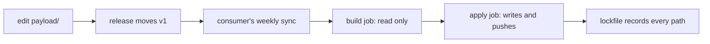

<!--
title: '🤖 AI INFRASTRUCTURE'
description: 'The publisher of agent instructions and configuration that every repository in this fleet receives by release, with no pull request and no build step.'
tags: [agent-infrastructure, distribution, publisher, instructions]
category: docs
-->

<!-- markdownlint-disable MD041 -->
<div align="center">

# 🤖 AI INFRASTRUCTURE

<a name="top"></a>

**One source of agent instructions and configuration, authored once as literal bytes and delivered to every repository that asks for it.**

_Written once. Delivered whole. Never pasted by hand._

</div>

---

## ⚠️ Read This Before You Install Anything

> [!WARNING]
> **A `.claude/settings.json` hook is arbitrary code execution on clone.** Claude Code 2.1.220 runs project hooks in headless `claude -p` inside a directory that has **never been trusted**, with no prompt and no trust record written. The workspace-trust dialog is an interactive-TUI gate only. It is **not** a control in CI, in cloud sessions, in background agents, or in any `git clone && claude -p` script.
>
> **Committing the stub is the act of consent.** There is no second confirmation, because there is nowhere left to put one.

Two consequences follow, and both are mechanisms rather than promises:

- 🛑 **The kill switch.** Create an empty file at `.ai/hooks/.disabled` from the GitHub web UI. Every shipped hook checks for it on the line after its shebang and exits immediately. No token, no sync, no publisher involvement, about thirty seconds per repository. This publisher never creates that file and never deletes it.
- 🔎 **Hook failures are invisible in headless mode.** `claude -p` prints its answer and exits 0 whether or not the hook fired, and `--output-format json` carries no hook field at all. `sh .ai/ai.sh verify` is the only command that can see a broken hook, and [`docs/Threat-Model.md`](docs/Threat-Model.md) explains why.

Read the [Threat Model](docs/Threat-Model.md) before you commit the stub, not after.

---

## 🎯 Our Strategic Intent

Every coding agent wants the same thing: the conventions of the repository it is working in. Each one insists on a **different filename**. Claude Code reads `CLAUDE.md` and has no discovery path for `AGENTS.md` at all. Gemini CLI reads `GEMINI.md`.

The usual answer is to write the file once and copy it by hand, which means copies that drift apart the first time one of them is edited. The other answer is to write it once and link the rest to it, which fails because **agents do not reliably follow links**.

This repository is the third answer: **a pure publisher**. The delivered files are stored here as literal bytes, in the shape they will occupy in a consuming repository. A release moves a tag, and every repository pinned to that tag receives the new bytes on its next scheduled run.

It follows the same shape as [`tannergolden/standards`](https://github.com/tannergolden/standards): commit a small stub, pin a major version, receive every later fix when that tag moves.

**There is no build step.** Reviewing a release is reading a diff of `payload/`, because `payload/` is what lands. A compiler whose output is byte-identical to its input is pure overhead that manufactures the one bug class this design most fears: an emitter defect reaching always-loaded instruction files in six repositories at once.

---

## 🤖 Supported Tools

Support means **tested and budgeted**, not merely reachable.

| Tool                              | Reads                                  | Status                  |
| :-------------------------------- | :------------------------------------- | :---------------------- |
| **Claude Code**                   | `CLAUDE.md`, which imports `AGENTS.md` | supported               |
| **Gemini CLI**                    | `GEMINI.md`, which imports `AGENTS.md` | supported               |
| anything else reading `AGENTS.md` | `AGENTS.md`                            | incidental, best effort |

Both routers are one import line over a shared body, so **two tools means three files** and `AGENTS.md` is the only one carrying content. That file is also read, unchanged, by tools nobody here tests. They are neither supported nor blocked: a contributor who arrives with one still gets this repository's conventions, which is a side effect worth having and not a promise worth making.

Adding a third tool is **additive**: one more router in `payload/`, one more `vendor` value in the lockfile. Nothing here is rewritten to do it, and that is the test the `vendor` field exists to make checkable:

```bash
jq -r '.files[] | select(.vendor == "claude") | .path' .ai/ai.lock.json
```

---

## 📥 Installing It: One File

A consuming repository commits **exactly one file**, copied from [`bootstrap/ai-sync.yml`](bootstrap/ai-sync.yml) to `.github/workflows/ai-sync.yml`. Everything else arrives from there on.

One file is the floor, not a compromise. The built-in `GITHUB_TOKEN` cannot write anything under `.github/workflows/`, so zero committed files would require a fleet-wide `workflows: write` credential, and that is the one credential whose theft could not be evicted.

> [!IMPORTANT]
> **The stub's `permissions:` block must equal [`ceiling.lock`](ceiling.lock) exactly.** A caller's permissions are a **ceiling, not a grant**. Too narrow and the consumer's run fails at startup with no job, no step and no log to read. Too wide and the consumer has granted scopes nobody declared. A job in this repository's CI compares the workflow, the lock and the stub on every push, because a drift there is invisible from every other angle.

---

## 🔃 How Distribution Works



The reusable workflow runs as two jobs, and the split is the point:

| Job     | Permissions                        | Does                                                               |
| :------ | :--------------------------------- | :----------------------------------------------------------------- |
| `build` | `contents: read`                   | checks the consumer out, runs the linters and the engine, packs it |
| `apply` | `actions: read`, `contents: write` | verifies the artifact against a digest, commits, pushes            |

The engine, the linters and the payload therefore never execute in a job holding a write token. Be honest about what that buys: it **reduces** the surface rather than eliminating it, because the `apply` job still runs YAML authored here. What it removes is several hundred lines of Python and the whole payload from the blast radius of the write scope.

The `actions: read` on that second row is not decoration, and a stub built without it fails at startup with nothing in the Actions tab to read. It is what lets the write job collect the build job's artifact with `gh`, which ships on the runner image, instead of running a third-party downloader action beside a token that can write to your default branch. Both scopes are in [`ceiling.lock`](ceiling.lock); copy that file, do not retype this table.

Three properties fall out of the shape, and each is deliberate:

- **No pull requests.** The push is made by the consuming repository's own built-in token, so the update simply arrives. The review happened here, on the diff of `payload/`, before the release.
- **No wave of workflow runs.** Pushes made with that token start no further runs, so a sync into a quiet repository stays quiet.
- **Clean removal.** The lockfile records every path written and its digest, so the inventory of what arrived is also the manifest for taking it away.

### 🚫 No pull request on the sync path, and no PR gate on any branch

Pull requests exist in this fleet only where `GITHUB_TOKEN` provably cannot write: stub upgrades under `.github/workflows/` (at most one announced edit per major), and Dependabot. Everything else is a direct push to `Development`, which is trunk here and the default branch, not a stage in a promotion ladder.

---

## 📦 What Is Published

| Path                                   | Vendor | Write mode                                      |
| :------------------------------------- | :----- | :---------------------------------------------- |
| `AGENTS.md`                            | both   | overwrite, **refuse on first contact**          |
| `CLAUDE.md`                            | claude | overwrite, refuse on first contact              |
| `GEMINI.md`                            | gemini | overwrite, refuse on first contact              |
| `.ai/ai.sh`                            | both   | overwrite                                       |
| `.ai/hooks/ai-context.sh`              | claude | overwrite                                       |
| `.claude/settings.json`                | claude | **merged by command prefix, never overwritten** |
| `.ai/ai.lock.json`, `.ai/ai.lock.date` | none   | receipts, rewritten every run                   |

**Read but never written:** the stub itself, `.ai/local/agents-local.md` (your own repository-specific law, folded into the delivered `AGENTS.md` between markers), and `.ai/hooks/.disabled` (the kill switch).

Two of those rows are load-bearing enough to state plainly:

- **`refuse on first contact`.** A file that already exists, is absent from the lockfile, and carries no generated header is treated as hand written, and the sync stops rather than overwriting it. `sh .ai/ai.sh adopt` moves a hand-written `AGENTS.md` into `.ai/local/agents-local.md`, so the law survives the installation instead of being traded for it.
- **`merged`.** `.claude/settings.json` is a repository's only committed, team-shared Claude configuration file, and Claude Code has no drop-in directory and no include. This publisher owns hook entries whose command begins with one frozen prefix, and nothing else in that file. Every other key and every foreign hook entry survives byte for byte.

Skills, subagents, command dialects and per-tool rule formats are **not** published. With two supported tools each of those reaches exactly one of them, and none has a subject yet.

---

## 🔎 What Is Checked, and What Is Only Counted

[`actions/ai-sync/check.py`](actions/ai-sync/check.py) is the whole linter suite: one file, standard library only. It runs twice, once here in CI and once at the consumer against the staged bytes before a single one is written. Five checks **gate**:

| Check         | Rejects                                                                                                                                                              |
| :------------ | :------------------------------------------------------------------------------------------------------------------------------------------------------------------- |
| **at-strict** | any `@token`, including inside backticks. Gemini reads it as an import and either substitutes an HTML comment over the line or inlines an arbitrary file recursively |
| **shellbang** | ` ```! ` and `` !`cmd` `` in any instruction file: inert in Gemini, live in Claude Code                                                                             |
| **invisible** | bidi overrides, zero-width and Unicode tag characters                                                                                                                |
| **permalink** | branch-form `github.com/.../blob/<branch>/` links in delivered output                                                                                                |
| **shape**     | any path outside the published set, scaffolding, non-POSIX shipped scripts, settings keys beyond `hooks`, and any hook command outside the frozen set                |

Byte counts and directive counts are **printed, never gated**. Neither supported tool truncates a long instruction file, so the only honest budget is session cost, and no corpus exists to calibrate one against. A number becomes a gate only after the corpus exists, the counting rule is one written paragraph, and it has run against the real files once without being tuned until it passed.

The most important job in [`ci.yml`](.github/workflows/ci.yml) is the one that asserts the checker **fails** on [`tests/fixtures/`](tests/fixtures). A checker that has never failed is not a checker, and a linter that silently stopped matching looks exactly like a clean repository.

---

## 🧯 If Something Goes Wrong

| Situation                              | Do this                                                                                                                  |
| :------------------------------------- | :----------------------------------------------------------------------------------------------------------------------- |
| A bad hook is out in the fleet         | Create `.ai/hooks/.disabled` in each repository from the web UI. Immediate, no sync needed                               |
| A bad release is out                   | `git tag -f v1 <good sha> && git push --force`. Fixes future runs only                                                   |
| One repository should stop syncing     | Delete its `.github/workflows/ai-sync.yml`                                                                               |
| One repository should be fully removed | `sh .ai/ai.sh remove`, which prints the plan, then `--force`. See the [Retirement Contract](docs/Retirement-Contract.md) |
| Is the hook actually running?          | `sh .ai/ai.sh verify`                                                                                                    |

The kill switch fixes the fleet in minutes; the tag fixes it on everyone's next scheduled run, which is weekly. That difference is the entire reason the kill switch exists.

---

## 🛠️ Working On This Repository

```bash
make setup    # install the commit-msg hook, once per clone
make check    # lint payload/, the bytes that will be published
make test     # prove the linter still rejects the hostile fixtures
make build    # copy payload/ instruction files to the root, dogfooding them
make verify   # fail if those generated root copies are stale
```

This repository consumes its own output: `AGENTS.md`, `CLAUDE.md` and `GEMINI.md` at the root are **generated copies** of the ones under `payload/`. Edit the payload, then `make build`. A publisher that does not run its own product finds every defect second.

---

## 🔗 See also

> [!TIP]
> [`docs/Repository-Layout.md`](docs/Repository-Layout.md) says where everything sits and which directory ships. [`docs/Threat-Model.md`](docs/Threat-Model.md) states what this can do to a repository that installs it. [`docs/Retirement-Contract.md`](docs/Retirement-Contract.md) defines when a delivered file may be deleted. The engineering standards this repository is built to live in [`tannergolden/standards`](https://github.com/tannergolden/standards) and are followed by link, never by copy.

---

<div align="center">

**One source. Literal bytes. No stale copies.**

[↑ Back to Top](#top)

</div>
