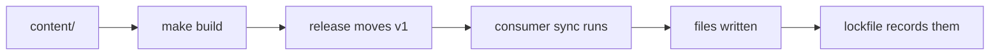

<!--
title: '🤖 AI INFRASTRUCTURE'
description: 'The publisher of agent instructions, skills and configuration that other repositories follow by link and receive by release.'
tags: [agent-infrastructure, distribution, publisher, instructions]
category: docs
-->

<!-- markdownlint-disable MD041 -->

# 🤖 AI INFRASTRUCTURE

**One source of agent instructions, skills and configuration, authored once and delivered to every repository that asks for it.**

_Written once. Shaped per tool. Never pasted by hand._

---

## 🎯 Our Strategic Intent

Every coding agent wants the same thing: the conventions of the repository it is working in. Each one insists on a **different filename, in a different format, in a different directory**. Claude Code reads `CLAUDE.md`. Gemini CLI reads `GEMINI.md`. Zed reads the first match in a fixed list. Copilot inside JetBrains reads one path and nothing else. Codex reads `AGENTS.md`, truncates it at 32 KB, and says nothing when it does.

The usual answer is to write the file once and copy it five times, which means five files that drift apart the first time one of them is edited. The other answer is to write it once and link the rest to it, which fails because **agents do not reliably follow links**.

This repository is the third answer. Content is authored **once**, in one neutral form. A build step emits every tool's dialect. A release delivers them. Nothing is copied by hand, and nothing goes stale, because the copies are outputs rather than sources.

It is a **publisher**, not a library. It follows the same shape as [`tannergolden/standards`](https://github.com/tannergolden/standards): a consuming repository commits a small stub, pins a major version, and receives every later fix when that tag moves.

---

## 🤖 Supported Tools

Support here means **tested, budgeted and guaranteed**, rather than merely reachable.

| Tool                              | Reads                                  | Status                  |
| :-------------------------------- | :------------------------------------- | :---------------------- |
| **Claude Code**                   | `CLAUDE.md`, which imports `AGENTS.md` | supported               |
| **Gemini CLI**                    | `GEMINI.md`, which imports `AGENTS.md` | supported               |
| anything else reading `AGENTS.md` | `AGENTS.md`                            | incidental, best effort |

Both supported tools work the same way: a one line router that imports a shared body. **Two tools therefore means three files**, and `AGENTS.md` is the one carrying the content.

That file is also read, unchanged, by tools nobody here tests: Codex, Cursor, Cline, Kilo, Continue, Kiro, Junie, Amp. They are neither supported nor blocked. A contributor who arrives with one of them still gets this repository's conventions, which is a side effect worth having and not a promise worth making.

---

## 💡 How It Works

The organising question is not what a file is about. It is **when the agent loads it**.

| Tier              | Loads                                                      | Holds                                             | Rule                                           |
| :---------------- | :--------------------------------------------------------- | :------------------------------------------------ | :--------------------------------------------- |
| **1. Always**     | every session, automatically                               | the canonical instruction file and its routers    | copied into the repository, and kept **small** |
| **2. On trigger** | when a glob matches, a skill is selected, a command is run | skills, path-scoped rules, prompts                | copied in, but costs nothing until it is used  |
| **3. Linked**     | only when a human or an agent follows the link             | governance long-form, rationale, decision records | **never copied**, referenced by permalink      |

The test for which tier something belongs to is short:

> **Copied** where failing to apply it is a **defect**.
> **Linked** where failing to read it is a **missed optimisation**.

Tier 1 carries two limits, and they rest on different footings.

The cap on **imperative directives** is the hard one. Instruction adherence degrades with the number of simultaneous rules rather than with file length, and that holds across models rather than being any one vendor's quirk. It is the primary constraint on what Tier 1 may say.

The cap on **bytes** is self imposed. Some tools truncate a long instruction file silently, which would make the limit external, but neither supported tool does. Here it is a budget rather than a wall: every byte in Tier 1 is paid for on every session, so the file is capped to keep that bill visible and deliberate.

---

## 🔃 How Distribution Works

A consuming repository commits **two files, once**:

| File                            | Purpose                                               |
| :------------------------------ | :---------------------------------------------------- |
| `.github/workflows/ai-sync.yml` | a stub that calls this repository's reusable workflow |
| `.ai/ai.toml`                   | how much to ship, and for which tools                 |

Everything else is generated. The stub pins a major version. Cutting a release here moves that tag, and each consumer picks the change up on its next run.

Three properties fall out of that shape, and each one is deliberate:

- **No pull requests.** The push is made by the consuming repository's own built in token, so the update simply arrives.
- **No wave of workflow runs.** Pushes made with that token start no further runs, so a sync into a quiet repository stays quiet.
- **Clean removal.** A lockfile records every path written, so the inventory of what arrived is also the manifest for taking it away.

---

## 📦 What Is Published

| Class              | Ships                                                                   | Reaches                                                           |
| :----------------- | :---------------------------------------------------------------------- | :---------------------------------------------------------------- |
| **Instructions**   | `AGENTS.md` and the two importing routers                               | both                                                              |
| **Runtime config** | one hook script, and the shared settings file that wires it             | Claude only. The settings file is **merged**, never overwritten   |
| **Receipt**        | a lockfile recording every path written and its digest                  | neither. It is bookkeeping, and it is also the uninstall manifest |
| **Skills**         | `SKILL.md` in the open Agent Skills format, at the path each tool reads | both, once any skill exists to ship                               |

Six written paths, not thirty. Subagents, command dialects and per tool rule formats are **not** published: with two tools each reaches exactly one of them, and neither has a subject yet. They are additive later, which is the test that this stayed easy to extend.

Repository specific knowledge is **not** published from here. A consuming repository writes its own section in a file this repository never overwrites, and the build folds that section into the delivered instructions so it loads with everything else.

---

## 🚧 Status

> [!IMPORTANT]
> **Nothing is published yet.** This repository is being built in the open, and the sections above describe the design it is being built to. Until the first release exists there is no stub to install and no version to pin.
>
> The build order is linters first, then content, then the instruction emitters, then distribution. That order is deliberate: a check that has never failed has never been tested, so every linter here is required to catch a real defect in a real file before it is trusted with anything.

---

## 🔗 See also

> [!TIP]
> The engineering standards this repository is built to live in [`tannergolden/standards`](https://github.com/tannergolden/standards), and are followed **by link, never by copy**, so they cannot go stale. The publisher pattern used here is documented there in full.

---

**One source. Many dialects. No stale copies.**

[↑ Back to Top](#top)

